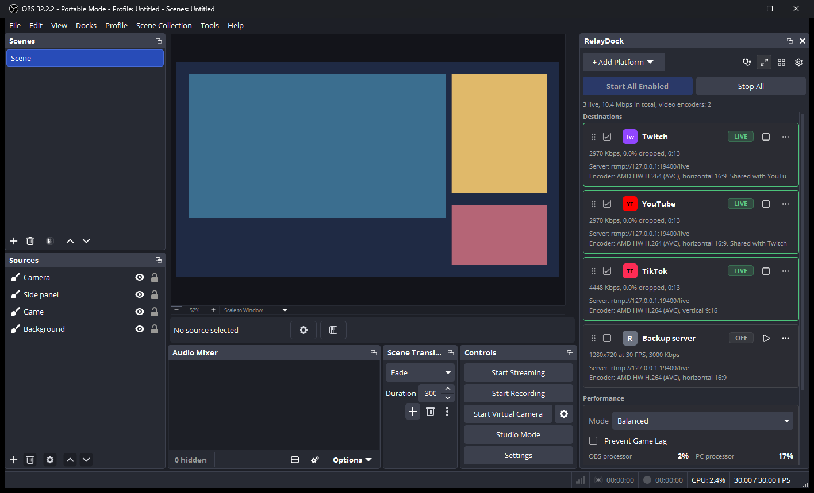
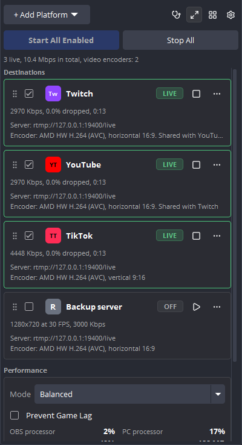
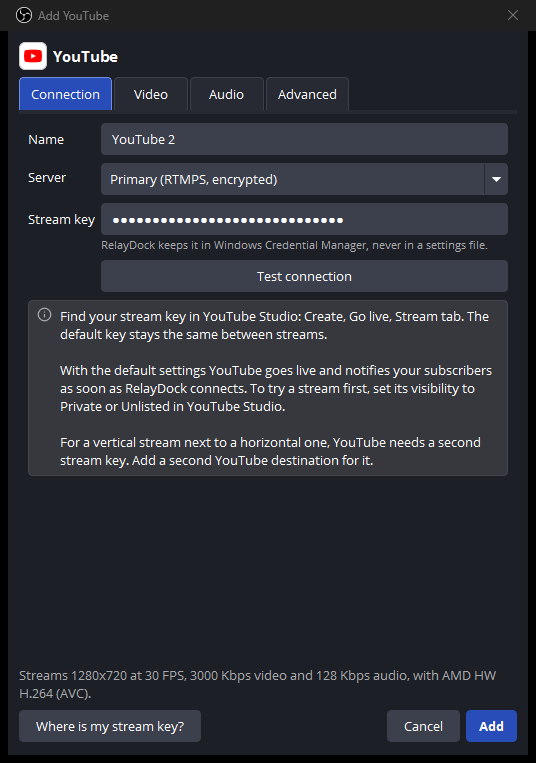
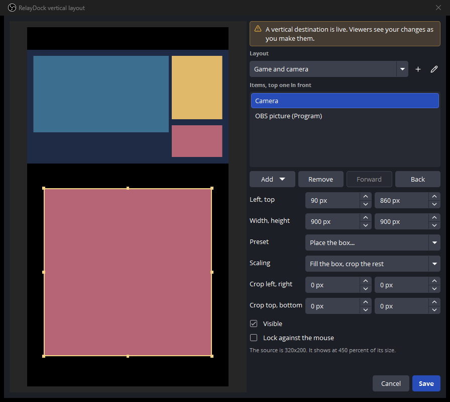
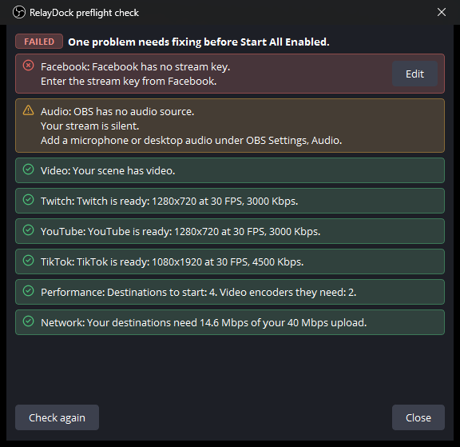
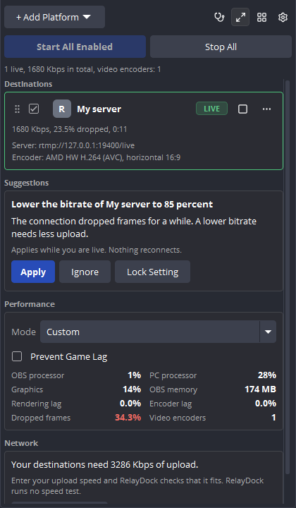
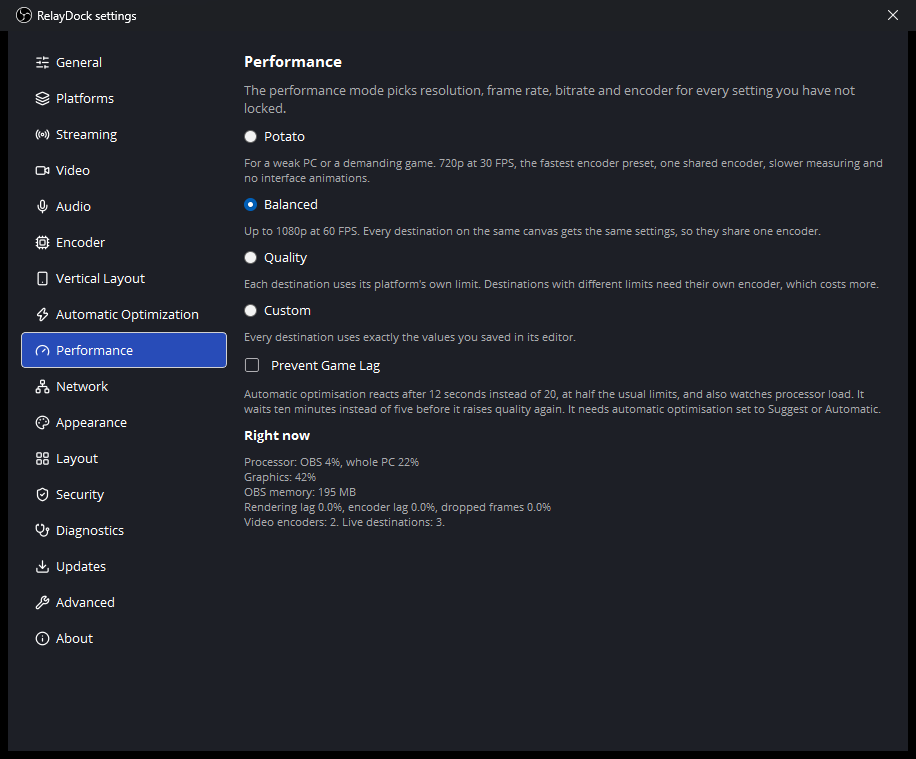
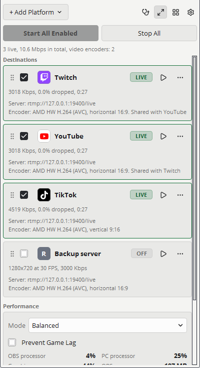

# RelayDock

A free and open-source OBS Studio multistream plugin that lets you stream to Twitch, TikTok, YouTube, Facebook, and custom RTMP or RTMPS destinations from one OBS session.

Your streams go straight from your PC to each platform. RelayDock has no server, no account, no subscription and no telemetry.

## Download

The newest version is release candidate 1.0.0-rc.1:

- [RelayDock-1.0.0-rc.1-windows-x64-Setup.exe](https://github.com/N4XION/RelayDock/releases/download/v1.0.0-rc.1/RelayDock-1.0.0-rc.1-windows-x64-Setup.exe), the installer, for an OBS Studio that is installed on your PC. Close OBS, run it, start OBS and open Docks, RelayDock.
- [RelayDock-1.0.0-rc.1-windows-x64.zip](https://github.com/N4XION/RelayDock/releases/download/v1.0.0-rc.1/RelayDock-1.0.0-rc.1-windows-x64.zip), for a portable OBS Studio.
- [Release notes and checksums](https://github.com/N4XION/RelayDock/releases/tag/v1.0.0-rc.1)

You need Windows 11 (64-bit) and OBS Studio 32.0.0 or newer. Windows SmartScreen may warn about the installer, because the files are not code-signed. [docs/installation.md](docs/installation.md) explains that and has the steps.

Every version is on the [Releases](../../releases) page, and [docs/release-notes](docs/release-notes) has the notes of each one.



## Status

This is release candidate 1.0.0-rc.1.

- Built and tested on Windows 11 with OBS Studio 32.0.4 and 32.2.2.
- Every feature below is covered by automated tests that stream to a test server on the same PC.
- No real platform has received a stream from this version in the project's own testing yet. That needs real accounts.
- The installer and the ZIP install are tested. Nobody has started an installed OBS Studio with RelayDock put there by the installer yet.
- [docs/testing.md](docs/testing.md) lists what is verified, and [docs/release-checklist.md](docs/release-checklist.md) lists what is still open before 1.0.0.

If you try it with a real platform, a [platform test report](../../issues/new/choose) helps the next person.

## What it does

- Streams to several destinations at once. Each has its own connection, so one failing or reconnecting never stops the others.
- Encodes once for destinations with identical settings. Three destinations can cost one encode.
- Streams horizontal 16:9 and vertical 9:16 at the same time. The vertical picture is cropped or fitted, never stretched.
- Four performance modes: Potato, Balanced, Quality and Custom.
- Rule-based automatic optimisation that suggests or applies a lower bitrate, frame rate or resolution when frames drop, and restores them later. You can lock any setting.
- A preflight check that says READY, WARNING or FAILED, with a reason and a fix for each finding.
- Protects a running stream. It asks before OBS closes, keeps the PC awake, and keeps the OBS video settings locked while a destination connects or waits to reconnect.
- Keeps stream keys in Windows Credential Manager. Never in a file, never in a log, never on screen.
- Looks like part of OBS, or the way you set it: themes, accent colour, background image, spacing, saved layouts.

## What it does not do

- It does not sign in to platforms. It cannot fetch your stream key, set a title, read chat or press Go live for you.
- It streams over RTMP and RTMPS only.
- It does not record.
- It runs on 64-bit Windows only.

[docs/known-limitations.md](docs/known-limitations.md) has the full list.

## Install

You need Windows 11 (64-bit) and OBS Studio 32.0.0 or newer.

1. Close OBS Studio.
2. Download `RelayDock-<version>-windows-x64-Setup.exe` from the [Releases](../../releases) page and run it.
3. Start OBS Studio and open Docks, RelayDock.

The release files are not code-signed, so Windows SmartScreen may warn about them. [docs/installation.md](docs/installation.md) explains why, and how to verify your download against `SHA256SUMS.txt`. For a portable OBS, or to copy the files yourself, see [docs/manual-installation.md](docs/manual-installation.md).

## First stream

1. Open the dock. Review the six short documents RelayDock shows once.
2. Choose + Add Platform, pick a platform and paste your stream key.
3. Add a second destination the same way.
4. Choose the stethoscope button to run the preflight check.
5. Choose Start All Enabled.

[docs/getting-started.md](docs/getting-started.md) walks through it.

| Platform | Guide |
| --- | --- |
| Twitch | [docs/twitch.md](docs/twitch.md) |
| YouTube | [docs/youtube.md](docs/youtube.md) |
| Facebook | [docs/facebook.md](docs/facebook.md) |
| TikTok | [docs/tiktok.md](docs/tiktok.md) |
| Any RTMP or RTMPS server | [docs/custom-rtmp.md](docs/custom-rtmp.md) |

## Screenshots

Every picture here is a capture of the real plugin running in OBS Studio, made by `tests/integration/Capture-Screenshots.ps1`. The destinations in them stream to a test server on the same PC.

### Destinations



### Adding a destination

The stream key field shows dots as you type. A saved key is never shown again.



### Horizontal and vertical at once



### Preflight check



### Automatic optimisation



### Settings



### Themes



## Performance

RelayDock adds work only for what you stream. Destinations with identical settings share one encoder, and the vertical canvas is rendered only while a vertical destination uses it.

[docs/performance-results.md](docs/performance-results.md) has numbers measured on the development PC with `tests/integration/Test-Performance.ps1`: idle cost, one to four destinations on a shared encoder, four separate encoders, and each performance mode. You can run the same script on your own PC.

[docs/performance.md](docs/performance.md) explains the modes, locks and automatic optimisation.

## Security and privacy

- Stream keys and RTMP passwords are saved in Windows Credential Manager, encrypted by Windows for your account.
- The settings file has no field that can hold a key.
- Keys are removed from every log line and from the diagnostics report.
- RelayDock opens network connections only for your streams, for Test connection, and for the update check when you ask for it.

[docs/security.md](docs/security.md) describes the design and what it cannot protect against. Report security problems privately, as [SECURITY.md](SECURITY.md) explains.

## Documentation

| Topic | Page |
| --- | --- |
| Install, update, uninstall | [docs/installation.md](docs/installation.md) |
| Install by hand, portable OBS | [docs/manual-installation.md](docs/manual-installation.md) |
| First steps | [docs/getting-started.md](docs/getting-started.md) |
| Modes, locks, optimisation | [docs/performance.md](docs/performance.md) |
| Themes and layouts | [docs/appearance.md](docs/appearance.md) |
| Keys, logs, network | [docs/security.md](docs/security.md) |
| When something fails | [docs/troubleshooting.md](docs/troubleshooting.md) |
| What is not supported | [docs/known-limitations.md](docs/known-limitations.md) |
| Build it yourself | [docs/building-from-source.md](docs/building-from-source.md) |
| How it is built inside | [docs/architecture.md](docs/architecture.md) |
| Tests and their results | [docs/testing.md](docs/testing.md) |
| Release steps | [docs/release-checklist.md](docs/release-checklist.md) |

## Build from source

```powershell
cmake --preset windows-x64
cmake --build --preset windows-x64
```

You need Visual Studio 2022 with the C++ workload. Everything else is fetched by the build. See [docs/building-from-source.md](docs/building-from-source.md).

## Contributing

Bug reports, platform test reports, translations and code are welcome. Read [CONTRIBUTING.md](CONTRIBUTING.md) and the [Code of Conduct](CODE_OF_CONDUCT.md) first.

## Licence

RelayDock is free software under the [GNU General Public License, version 2 or later](LICENSE). It comes with no warranty.

Third-party software and its licences are listed in [THIRD_PARTY_LICENSES.md](THIRD_PARTY_LICENSES.md). The privacy policy is in [PRIVACY.md](PRIVACY.md).

RelayDock is not affiliated with Twitch, TikTok, YouTube, Facebook or the OBS Project. Their names are trademarks of their owners. RelayDock ships no platform logos.
