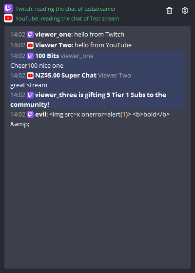
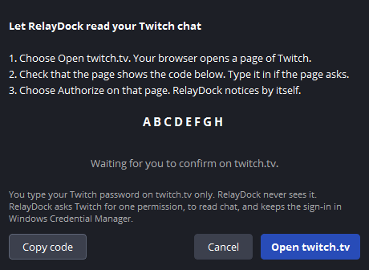

# Chat

The RelayDock Chat dock shows the comments of your Twitch and YouTube streams in one list, in the order they arrive. Bits, Super Chats, gifts, new subscribers and raids stand out.

The comments in the picture are made up by a test.

Open the dock from the OBS Docks menu, RelayDock Chat. Set it up under RelayDock settings, Chat.

## What it reads, and what it does not

| Platform | Comments | Gifts and paid events | What you need |
| --- | --- | --- | --- |
| Twitch | Yes | Bits, subscriptions, gift subscriptions, raids | A sign-in on twitch.tv |
| YouTube | Yes | Super Chats, Super Stickers, new members, gifted memberships, gifts paid with Jewels | A Google API key of your own, and the link to your stream |
| TikTok | No | No | TikTok publishes no way to read live chat |
| Facebook | No | No | Meta's interface needs an approval that RelayDock does not have |

RelayDock reads chat only through interfaces the platforms publish. [research/live-chat.md](research/live-chat.md) has the details and the sources.

The dock is for you, not for your viewers. Twitch's simulcasting rules do not allow showing the chat of other platforms on your Twitch stream. Do not put the dock into a scene that goes to Twitch.

## Twitch

### Once: the application id

RelayDock signs in to Twitch as an application, and every application has an id that Twitch calls Client ID. It is a public name, not a secret.

Settings, Chat tells you whether your RelayDock comes with one. If it does, skip this part.

If it does not, register an application with Twitch. It is free.

1. Switch on two-factor authentication for your Twitch account. Twitch requires it for the next step.
2. Open `https://dev.twitch.tv/console` and sign in.
3. Choose Applications, then Register Your Application.
4. Name: any name nobody else uses, such as "RelayDock chat" followed by your channel name.
5. OAuth Redirect URLs: `http://localhost`
6. Category: Broadcaster Suite.
7. Client Type: Public.
8. Choose Create, then Manage, and copy the Client ID.
9. In RelayDock, open Settings, Chat and paste it into Twitch application id.

### Sign in

1. In Settings, Chat choose Sign in with Twitch.
2. RelayDock shows a code. Choose Open twitch.tv.
3. Your browser opens a page of Twitch. Sign in there if Twitch asks, and check that the page shows the same code.
4. Choose Authorize.

RelayDock notices by itself and starts reading your chat. You type your Twitch password on twitch.tv only. RelayDock never sees it.

RelayDock asks Twitch for one permission: to read chat. It cannot write to your chat, change your channel or see anything else.

Twitch ends a sign-in that goes unused for 30 days. RelayDock then says so, and you sign in again.

### Sign out

Sign out under Settings, Chat forgets the sign-in on this PC. To end RelayDock's permission at Twitch as well, open twitch.tv, Settings, Connections.

## YouTube

YouTube's rules do not allow an open-source program to come with an API key. So you create one of your own. It is free.

### Once: the API key

1. Open `https://console.cloud.google.com` and sign in with a Google account.
2. Create a project. Any name works.
3. Open APIs and Services, then Library. Find YouTube Data API v3 and choose Enable.
4. Open APIs and Services, then Credentials. Choose Create credentials, then API key.
5. Copy the key. To be safe, choose Edit API key and restrict it to YouTube Data API v3.
6. In RelayDock, open Settings, Chat, paste the key and choose Save key.

RelayDock keeps the key in Windows Credential Manager and never shows it again. Treat it like a password.

### Every stream: the link

A YouTube stream has a new link every time.

1. Start your stream on YouTube. It must be public or unlisted, with chat switched on.
2. Copy the link to the stream from your browser, or from YouTube Studio under Go live, Share.
3. In RelayDock, open Settings, Chat, paste it into Link to your stream and choose Connect.

RelayDock stops by itself when the stream ends.

### The daily amount

Google gives every key 10,000 units a day. They start again at midnight Pacific Time.

RelayDock asks YouTube for new comments again and again. Google's cost table lists such a request at 1 unit, checked on 2026-10-04. With the standard pause of 5 seconds, a stream uses 720 requests an hour.

When the amount is used up, RelayDock says so and stops asking. A longer pause under Settings, Chat makes the amount last longer. Settings, Chat also shows how many requests RelayDock has sent since OBS started.

## TikTok

TikTok publishes no interface for live comments or gifts. Tools that show them read a private channel of TikTok, which TikTok's terms do not allow. RelayDock does not do that.

What stays inside TikTok's rules is TikTok's own page for the host of a stream. You can put that page into an OBS dock:

1. In OBS, open Docks, Custom Browser Docks.
2. Dock name: TikTok chat. URL: `https://livecenter.tiktok.com/live_monitor`
3. Choose Apply, and sign in to TikTok in the dock.

The page belongs to TikTok. It sits next to the RelayDock Chat dock and is not part of its list. The project has not tested this page inside OBS.

## Facebook

Meta publishes an interface for the comments of a live video. An application may use it for other people only after Meta's App Review and a verified business. RelayDock has neither, so it reads no Facebook comments.

## What RelayDock keeps

- The Twitch sign-in and the YouTube key: in Windows Credential Manager.
- Your Twitch name and the link to your stream: in the settings file. They are no secrets.
- The comments: the newest 500, in memory, until OBS closes. RelayDock writes no comment to a file, to the log or to a diagnostics report.

A comment is shown as the text it is. Nothing in a comment can become a link, a picture or formatting.

## What is tested

The chat readers are tested against stand-ins for Twitch and YouTube on the development PC, which follow the interfaces the two platforms publish. [testing.md](testing.md) describes the tests.

Nobody has signed in to the real Twitch, or read a real YouTube chat, with RelayDock yet. If it does not work for you, open an issue and say what the dock and Settings, Chat show.

## When it does not work

| The dock says | What to do |
| --- | --- |
| Twitch: not set up | Sign in under Settings, Chat. Without an application id, enter one first. |
| Twitch: not connected, trying again | RelayDock tries again by itself. Check your internet connection. |
| Twitch no longer accepts the saved sign-in | Sign in again under Settings, Chat. |
| YouTube: not set up | Save an API key under Settings, Chat. |
| Google did not accept your API key | Check the key. A key with restrictions must allow YouTube Data API v3. |
| The Google project of your API key has the YouTube Data API switched off | Enable YouTube Data API v3 for that project in the Google Cloud console. |
| This YouTube stream has no live chat right now | Start the stream, or paste the link of the stream that is live. RelayDock looks again every minute. |
| Your API key has used its requests for today | Wait until midnight Pacific Time, or raise the pause between requests. |
| The YouTube stream has ended | Paste the link of your next stream. |
